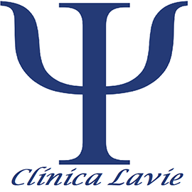
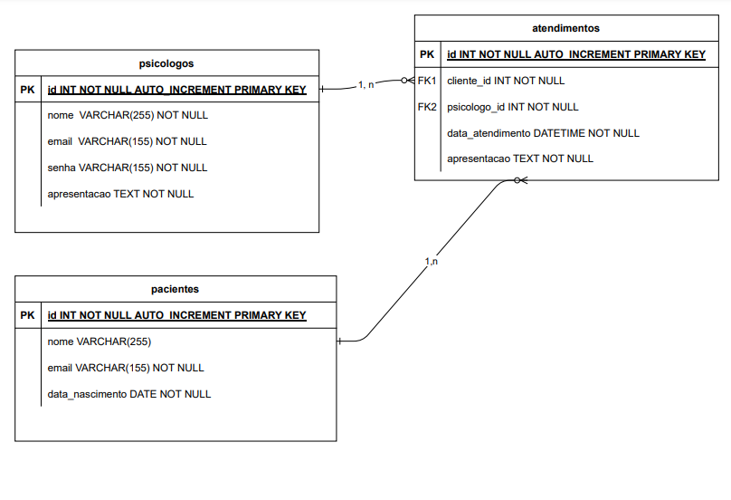
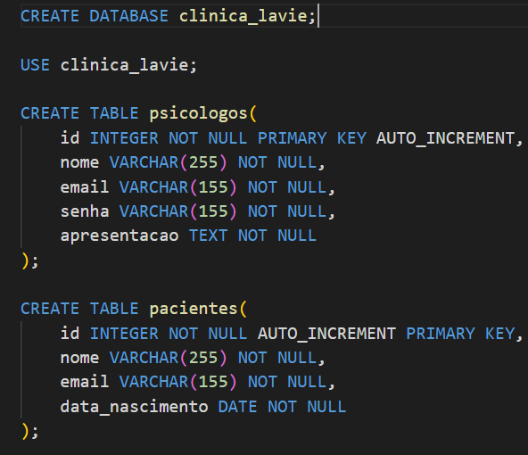

# Projeto API Clínica Lavie.

## 📝 ***Sobre***
O **Projeto API Clínica Lavie** foi desenvolvido com o intuito de colocar em prática parte de conteúdo aprendido pelo curso oferecido pela **Gama Academy Experience**, conhecido como Gama XP, em sua versão 47.

## 🚀 ***Técnologias Utilizadas***
Este projeto foi desenvolvido utilizando as seguintes técnologias:
- Node.js;
- Express;
- Banco de dados MySQL.

Essas tecnologias agrupadas possibilitaram a construção de uma API que 
contém os endpoints responsáveis por executar o CRUD para cada entidade 
da base de dados.

 ##  Diagrama esquemático da base de dados.

Abaixo é possivel observar o Diagrama esquemático desenvolvido para a realização da base de dados:

## Scrip SQL.

Abaixo é possivel observar o Scrip de SQL onde é criado a base de dados, a solicitação para utilizar a base de dados criada e a criação de tabelas de para o cadastro de psicologos e pacientes:

Abaixo é possivel observar o Scrip de SQL onde é criado para o atendimento, ligando o paciente ao psicologo:

## 📥 ***Documentação da API***
A documentação da API pode ser visualizada no link abaixo:

http://crdigital.github.com/api_clinica_lavie
